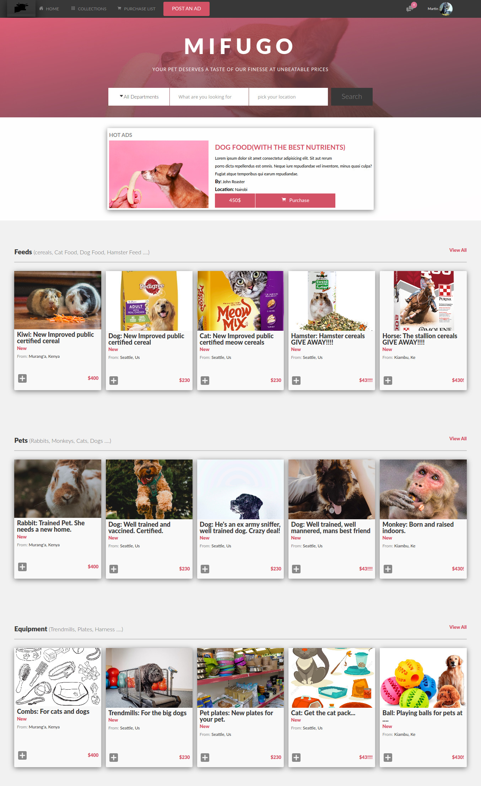

# Html-capstone
This is the design layout of an online pet feeds store, Mifugo. Mifugo is an e-commerce site with no functionality whatsoever. It was built with the whole layout being inspired by the design idea from [Mohammed Awad](https://www.behance.net/gallery/24796463/ZATTIX) on Behance.  It show cases the use of html5 and css3.

## Built With

- Html5
- css3

## Live Demo

[Live Demo Link](https://rawcdn.githack.com/menyagah/Html-capstone/931a09761fa5d99864a7a295486071fd12047c5f/index.html)

## Video Demo

[Video Demo Link](https://www.loom.com/share/e83a186e670841e388271cf88e8a6fe3)

## Getting Started

This is a basic html5 and css3 webpage that is static. 
 - clone or download the files from the github repo 
 - Open the file directory
 - click on index.html to launch the webpage.
 

- Below is a screenshot of the nextweb clone in action.

This was a solo project. The project uses basic html5 and css3. 

## Author

👤 **Author1**

- Github: [@menyagah](https://github.com/menyagah)
- Twitter: [@Martinnyaga20](https://twitter.com/Martinnyaga20)
- Linkedin: [linkedin](https://linkedin.com/linkedinhandle)
- Email: [menyagah27@gmail.com]

## 🤝 Contributing

Contributions, issues and feature requests are welcome!

Feel free to check the [issues page](issues/).

## Show your support

Give a ⭐️ if you like this project!

## Acknowledgments

- Much appreciation to  Mohammed Awad on Behance.
- Behance : [Mohammed Awad](https://www.behance.net/M_Awad)
- Resource : [Behance](https://www.behance.net/gallery/24796463/ZATTIX)

## 📝 License

This project is [MIT](lic.url) licensed.
